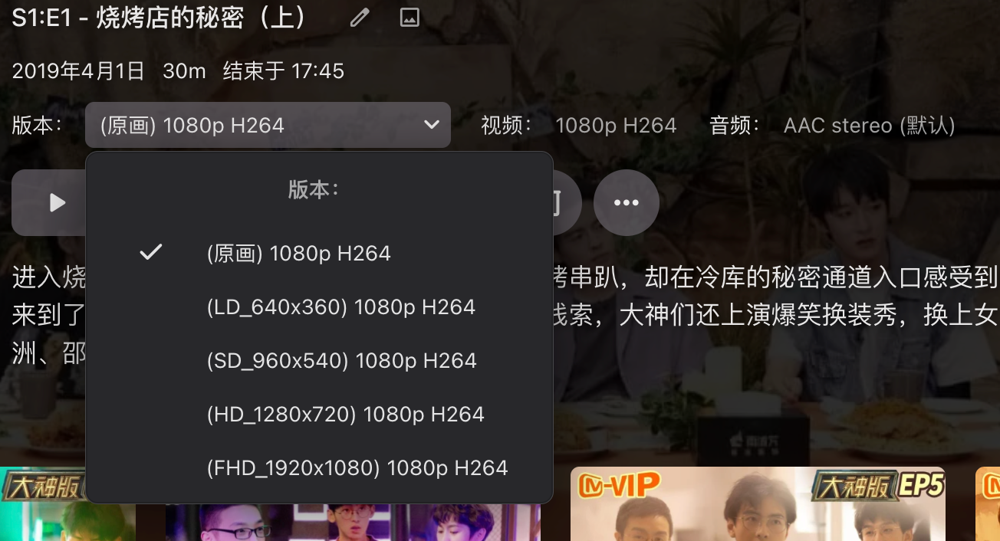

# go-emby2alist

使用 Go 语言编写的网盘直链反向代理服务，为 Emby + Alist 组合提供更好的使用体验。

> **网盘直链反向代理**:~~（Tips：如果你不是小白，这一段可以不用看了）~~
>
> 正常情况下，Emby 通过磁盘挂载的形式间接读取网盘资源，走的是服务器代理模式，看一个视频时数据链路是：
>
> > 客户端 => Emby 源服务器 => 磁盘挂载服务 => Alist => 网盘
> >
> > 客户端 <= Emby 源服务器 <= 磁盘挂载服务（将视频数据加载到本地，再给 Emby 读取） <= Alist <= 网盘
>
> 这种情况有以下局限：
>
> 1. 视频经过服务器中转，你看视频的最大加载速度就是服务器的上传带宽
> 2. 如果服务器性能不行，能流畅播放 1080p 就谢天谢地了，更别说 4K
> 3. ...
>
> 使用网盘直链反向代理后，数据链路：
>
> > 客户端 => Emby 反代服务器 => Emby 源服务器 （请求 Emby Api 接口）
> >
> > 客户端 <= Emby 反代服务器 <= Emby 源服务器 （返回数据）
>
> 对于普通的 Api 接口，反代服务器将请求反代到源服务器，再将合适的结果进行缓存，返回给客户端
>
> 对于客户端来说，这一步和直连源服务器看不出差别
>
> > 客户端 => Emby 反代服务器 => Alist => 网盘 （请求视频直链）
> >
> > 客户端 <= Emby 反代服务器 <= Alist <= 网盘 （返回视频直链，并给出重定向响应）
> >
> > 客户端 => 网盘（客户端拿着网盘的直链直接观看，此时已经没有服务器的事情了，故不会再消耗服务器流量）
>
> 这种方式的好处：
>
> 1. 观看时加载速度拉满（前提是有网盘会员）
> 2. 在客户端处解码，能不能看 4K 取决于你电视盒子的性能

> 本项目只专注服务于网盘，且不打算兼容 Jellyfin / Plex（这两个我也用过，说实话真不如 Emby），主打一个易用和轻巧，如果你的 Emby 有其他类型的资源（Strm、本地资源），推荐使用[功能更完善的反向代理服务](https://github.com/bpking1/embyExternalUrl)


**功能**：

- 静态资源 301 重定向
- Alist 网盘原画直链播放
- Alist 网盘转码直链播放

- websocket 代理
- 客户端防转码（转容器）
- 缓存中间件，实际使用体验不会比直连源服务器差
- 字幕缓存（字幕缓存时间固定 30 天）
- 直链缓存（为了兼容阿里云盘，直链缓存时间目前固定为 10 分钟，其他云盘暂无测试）
- 大接口缓存（Alist 转码资源是通过代理并修改 PlaybackInfo 接口实现，请求比较耗时，每次大约 2~3 秒左右，目前已经利用 Go 语言的并发优势，尽力地将接口处理逻辑异步化，快的话 1 秒即可请求完成，该接口的缓存时间目前固定为 12 小时，后续如果出现异常再作调整）


**已测试并支持的客户端**：

| 客户端                           | 已知问题                                                     |
| -------------------------------- | ------------------------------------------------------------ |
| `Emby Web`                       | 无法正常播放 Alist 转码 m3u8 直链                            |
| `Emby for macOS`，`Emby for iOS` | 基本的操作都正常，~~由于本人没这两个客户端的高级版~~，无法测试播放功能 |
| `Emby for Android`               | 使用安卓 TV 测试，功能大部分正常，Alist 转码 m3u8 直链可播放，可保存进度，但是无法恢复播放，且在播放时会出现跳帧的情况（直链过期） |
| `Fileball`                       | 所有功能可用，缺点是只支持 IOS                               |
| `Infuse`                         | 功能大部分正常，只支持播放原画直链（在设置中将缓存方式设置为`不缓存`可有效防止频繁请求） |
| `VidHub`                         | 所有功能可用，缺点同样是只支持苹果全家桶（~~并且收费~~）     |
| `音流 StreamMusic`               | 直连模式正常可用（~~媒体库模式没测试，个人觉得没必要~~）     |


## 使用说明

1. 已有自己的 Emby、Alist 服务器

2. Emby 的媒体库路径（本地磁盘路径）是和 Alist 挂载路径能够对应上的

   > 这一步前缀对应不上没关系，可以在配置中配置前缀映射 `path.emby2alist` 解决

3. 需要有一个中间服务，将网盘的文件数据挂载到系统本地磁盘上，才能被 Emby 读取到

   > 目前我知道的比较好用的服务有两个：[rclone](https://rclone.org/) 和 [CloudDrive2](https://www.clouddrive2.com/)(简称 cd2)
   >
   > 
   >
   > 如果你的网盘跟我一样是阿里云盘，推荐使用 cd2 直接连接阿里云盘，然后根路径和 Alist 保持即可
   >
   > 在 cd2 中，找到一个 `最大缓存大小` 的配置，推荐将其设为一个极小值（我是 1MB），这样在刮削的时候就不会消耗太多三方权益包的流量
   >
   > 
   >
   > ⚠️ 不推荐中间服务直接去连接 Alist 的 WebDav 服务，如果 Alist Token 刷新失败或者是请求频繁被暂时屏蔽，会导致系统本地的挂载路径丢失，Emby 就会认为资源被删除了，然后元数据就丢了，再重新挂载回来后就需要重新刮削了。

4. 服务器有安装 Docker

   > 网上有很多 Docker 安装教程，这里我不细说
   >
   > 不过在国内，很多镜像服务器都不能正常使用了
   >
   > 这里推荐一个好用的[镜像加速源](https://dockerpull.com)

## 使用 DockerCompose 部署安装

1. 获取代码

```shell
git clone --branch 1.0.1 --depth 1 https://ghproxy.cc/https://github.com/AmbitiousJun/go-emby2alist
cd go-emby2alist
```

2. 拷贝配置

```shell
cp config-example.yml config.yml
```

3. 根据自己的服务器配置好 `config.yml` 文件
4. 编译并运行容器

```shell
docker-compose up -d --build
```

5. 浏览器访问服务器 ip + 端口 `8095`，开始使用

   > 如需要自定义端口，在第四步编译之前，修改 `docker-compose.yml` 文件中的 `8095:8095` 为 `[自定义端口]:8095` 即可

6. 日志查看

```shell
docker logs -f go-emby2alist -n 1000
```

7. 修改配置的时候需要重新启动容器

```shell
docker-compose down
# 修改 config.yml ...
docker-compose up -d
```

8. 版本更新

```shell
docker-compose down
git fetch origin +refs/heads/*:refs/remotes/origin/*
git checkout <版本号>
git pull
docker-compose up -d --build
```

9. 清除过时的 Docker 镜像

```shell
docker image prune -f
```


## 开发计划

1. - [ ] 进一步优化 m3u8 转码直链的兼容性
1. - [ ] 电视直播直链反代（实现真直链反代，~~不一定能实现~~）

## Star History

<a href="https://star-history.com/#AmbitiousJun/go-emby2alist&Date">
 <picture>
   <source media="(prefers-color-scheme: dark)" srcset="https://api.star-history.com/svg?repos=AmbitiousJun/go-emby2alist&type=Date&theme=dark" />
   <source media="(prefers-color-scheme: light)" srcset="https://api.star-history.com/svg?repos=AmbitiousJun/go-emby2alist&type=Date" />
   
 </picture>
</a>