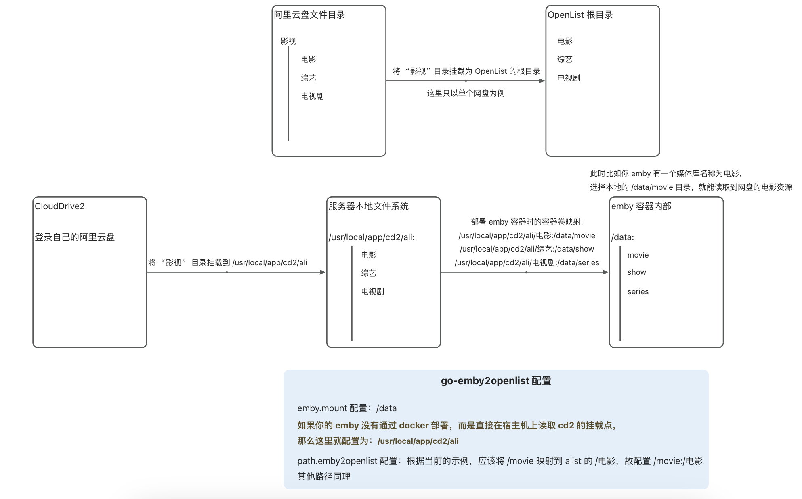

<h1 align="center">go-emby2alist</h1>

<div align="center">
  <a href="https://github.com/AmbitiousJun/go-emby2alist/tree/v1.3.0"></img></a>
  <a href="https://hub.docker.com/r/ambitiousjun/go-emby2alist/tags"></img></a>
  <a href="https://hub.docker.com/r/ambitiousjun/go-emby2alist/tags"></img></a>
  <a href="https://goreportcard.com/report/github.com/AmbitiousJun/go-emby2alist"></img></a>
  </img>
  </img>
</div>

<div align="center">
  使用 Go 语言编写的网盘直链反向代理服务，为 Emby + Alist 组合提供更好的使用体验。
</div>

## 小白必看

**网盘直链反向代理**:

正常情况下，Emby 通过磁盘挂载的形式间接读取网盘资源，走的是服务器代理模式，看一个视频时数据链路是：

> 客户端 => Emby 源服务器 => 磁盘挂载服务 => Alist => 网盘
>
> 客户端 <= Emby 源服务器 <= 磁盘挂载服务（将视频数据加载到本地，再给 Emby 读取） <= Alist <= 网盘

这种情况有以下局限：

1. 视频经过服务器中转，你看视频的最大加载速度就是服务器的上传带宽
2. 如果服务器性能不行，能流畅播放 1080p 就谢天谢地了，更别说 4K
3. ...

使用网盘直链反向代理后，数据链路：

> 客户端 => Emby 反代服务器 => Emby 源服务器 （请求 Emby Api 接口）
>
> 客户端 <= Emby 反代服务器 <= Emby 源服务器 （返回数据）

对于普通的 Api 接口，反代服务器将请求反代到源服务器，再将合适的结果进行缓存，返回给客户端

对于客户端来说，这一步和直连源服务器看不出差别

> 客户端 => Emby 反代服务器 => Alist => 网盘 （请求视频直链）
>
> 客户端 <= Emby 反代服务器 <= Alist <= 网盘 （返回视频直链，并给出重定向响应）
>
> 客户端 => 网盘（客户端拿着网盘的直链直接观看，此时已经没有服务器的事情了，故不会再消耗服务器流量）

这种方式的好处：

1. 观看时加载速度拉满（前提是有网盘会员）
2. 在客户端处解码，能不能看 4K 取决于你电视盒子的性能

## 使用前须知

1. 本项目初衷: 易用轻巧、小白友好、高度适配阿里云盘 (如果你使用本项目观看其他网盘时出现问题，也欢迎到 issue 区反馈，我会尽量适配它)

2. 如果你有更复杂的需求, 推荐使用[功能更完善的反向代理服务](https://github.com/bpking1/embyExternalUrl)

## 功能

- Alist 网盘原画直链播放

- Strm 直链播放

- Alist 网盘转码直链播放

  > 该功能是通过请求 Alist 的 `/api/fs/other` 接口来实现转码直链获取
  >
  > 该接口并不是对所有网盘驱动都支持，目前已知 Aliyun_Open 可以正常体验
  >
  > 
  >
  > **是否消耗三方流量包流量**：🙅
  >
  > **非会员是否限速**：自行测试
  >
  > 
  >
  > 示例图 ↓：
  >
  > 
  >
  > 
  >
  > 现阶段，转码资源直链已达到可正常使用的标准
  >
  > Emby Web, Emby for AndroidTV 以及其他的客户端都可以正常播放，并且不会因为直链过期而中断
  >
  > 
  >
  > 局限：
  >
  > 如果是有多个内置音频的，转码直链只能播放其中的默认音频
  >
  > 视频本身的内封字幕会丢失，Alist 接口虽然也返回了转码字幕直链地址，已经适配到**转码资源**的 PlaybackInfo 中，但是只有部分客户端能够正常挂载上，具体原因不明，示例图 ↓：
  >
  > 
  >
  >
  > 不过好在有的客户端是能将原画的**部分**内封字幕挂载到转码资源上的，比如 Fileball：
  >
  > 只需要在开始播放之前，在字幕一栏选中自己想要的字幕，再点击播放后就能挂载上去
  >
  > 

- websocket 代理

- 客户端防转码（转容器）

- 缓存中间件，实际使用体验不会比直连源服务器差

- 字幕缓存（字幕缓存时间固定 30 天）

  > 目前还无法阻止 Emby 去本地挂载文件上读取字幕
  >
  > 带字幕的视频首次播放时，Emby 会调用 FFmpeg 将字幕从本地文件中提取出来，再进行缓存
  >
  > 也就是说：
  >
  > - 首次提取时，速度会很慢，有可能得等个大半天才能看到字幕（使用第三方播放器【如 `MX player`, `Fileball`】可以解决）
  > - 带字幕的视频首次播放时，还是会消耗服务器的流量

- 直链缓存（为了兼容阿里云盘，直链缓存时间目前固定为 10 分钟，其他云盘暂无测试）

- 大接口缓存（Alist 转码资源是通过代理并修改 PlaybackInfo 接口实现，请求比较耗时，每次大约 2~3 秒左右，目前已经利用 Go 语言的并发优势，尽力地将接口处理逻辑异步化，快的话 1 秒即可请求完成，该接口的缓存时间目前固定为 12 小时，后续如果出现异常再作调整）


## 已测试并支持的客户端

| 名称                     | 最后测试版本 | 原画 | 其他说明（原画）                                             | 阿里转码 | 其他说明（阿里转码）                                         |
| ------------------------ | ------------ | ---- | ------------------------------------------------------------ | -------- | ------------------------------------------------------------ |
| `Emby Web`               | `4.8.8.0`    | ✅    | ——                                                           | ✅        | 1. 转码字幕有概率挂载不上<br />2. 可以挂载原画字幕           |
| `Emby for iOS`           | ——           | ❓    | ~~没高级订阅测不了~~                                         | ❓        | ~~没高级订阅测不了~~                                         |
| `Emby for macOS`         | ——           | ❓    | ~~没高级订阅测不了~~                                         | ❓        | ~~没高级订阅测不了~~                                         |
| `Emby for Android`       | `3.4.23`     | ✅    | ——                                                           | ✅        | ——                                                           |
| `Emby for AndroidTV`     | `2.0.95g`    | ✅    | 遥控器调进度可能会触发直链服务器的频繁请求限制，导致视频短暂不可播情况 | ✅        | 无法挂载字幕                                                 |
| `Fileball`               | ——           | ✅    | ——                                                           | ✅        | ——                                                           |
| `Infuse`                 | ——           | ✅    | 在设置中将缓存方式设置为`不缓存`可有效防止触发频繁请求       | ❌        | ——                                                           |
| `VidHub`                 | ——           | ✅    | 仅测试至 `1.0.7` 版本                                        | ✅        | 仅测试至 `1.0.7` 版本                                        |
| `Stream Music`           | `1.3.4`      | ✅    | ——                                                           | ——       | ——                                                           |
| `Emby for Kodi Next Gen` | `11.1.13`    | ✅    | ——                                                           | ✅        | 1. 需要开启插件设置：**播放/视频转码/prores**<br />2. 播放时若未显示转码版本选择，需重置本地数据库重新全量扫描资料库<br />3. 某个版本播放失败需要切换版本时，必须重启 kodi 才能重新选择版本<br />4. 无法挂载字幕 |


## 使用说明

1. 已有自己的 Emby、Alist 服务器

2. Emby 的媒体库路径（本地磁盘路径）是和 Alist 挂载路径能够对应上的

   > 这一步前缀对应不上没关系，可以在配置中配置前缀映射 `path.emby2alist` 解决

3. 需要有一个中间服务，将网盘的文件数据挂载到系统本地磁盘上，才能被 Emby 读取到

   > 目前我知道的比较好用的服务有两个：[rclone](https://rclone.org/) 和 [CloudDrive2](https://www.clouddrive2.com/)(简称 cd2)
   >
   > 
   >
   > 如果你的网盘跟我一样是阿里云盘，推荐使用 cd2 直接连接阿里云盘，然后根路径和 Alist 保持即可
   >
   > 在 cd2 中，找到一个 `最大缓存大小` 的配置，推荐将其设为一个极小值（我是 1MB），这样在刮削的时候就不会消耗太多三方权益包的流量
   >
   > 
   >
   > ⚠️ 不推荐中间服务直接去连接 Alist 的 WebDav 服务，如果 Alist Token 刷新失败或者是请求频繁被暂时屏蔽，会导致系统本地的挂载路径丢失，Emby 就会认为资源被删除了，然后元数据就丢了，再重新挂载回来后就需要重新刮削了。

4. 服务器有安装 Docker

   > 网上有很多 Docker 安装教程，这里我不细说
   >
   > 不过在国内，很多镜像服务器都不能正常使用了
   >
   > ~~这里推荐一个好用的[镜像加速源](https://baidu.com)~~
   >
   > 由于加速源作者服务器压力太大，我就不再这再推荐了

5. Git

   > 非必须，如果你想体验测试版，就需要通过 Git 拉取远程源码构建
   >
   > 正式版可以直接使用现成的 Docker 镜像

## 使用 DockerCompose 部署安装

### 通过源码构建

1. 获取代码

```shell
git clone --branch v1.3.0 --depth 1 https://ghproxy.cc/https://github.com/AmbitiousJun/go-emby2alist
cd go-emby2alist
```

2. 拷贝配置

```shell
cp config-example.yml config.yml
```

3. 根据自己的服务器配置好 `config.yml` 文件

关于路径映射的配置示例图：



4. 编译并运行容器

```shell
docker-compose up -d --build
```

5. 浏览器访问服务器 ip + 端口 `8095`，开始使用

   > 如需要自定义端口，在第四步编译之前，修改 `docker-compose.yml` 文件中的 `8095:8095` 为 `[自定义端口]:8095` 即可

6. 日志查看

```shell
docker logs -f go-emby2alist -n 1000
```

7. 修改配置的时候需要重新启动容器

```shell
docker-compose down
# 修改 config.yml ...
docker-compose up -d
```

8. 版本更新

```shell
# 获取到最新代码后, 可以检查一下 config-example.yml 是否有新增配置
# 及时同步自己的 config.yml 才能用上新功能

# 更新到正式版
docker-compose down
git fetch --tag
git checkout <版本号>
git pull
docker-compose up -d --build

# 更新到测试版 (仅尝鲜, 不稳定)
docker-compose down
git checkout main
git pull origin main
docker-compose up -d --build
```

9. 清除过时的 Docker 镜像

```shell
docker image prune -f
```

### 使用现有镜像

1. 准备配置

参考[示例配置](https://github.com/AmbitiousJun/go-emby2alist/blob/v1.3.0/config-example.yml)，配置好自己的服务器信息，保存并命名为 `config.yml`

2. 创建 docker-compose 文件

在配置相同目录下，创建 `docker-compose.yml` 粘贴以下代码：

```yaml
version: "3.1"
services:
  go-emby2alist:
    image: ambitiousjun/go-emby2alist:v1.3.0
    environment:
      - TZ=Asia/Shanghai
      - GIN_MODE=release
    container_name: go-emby2alist
    volumes:
      - ./config.yml:/app/config.yml
      - ./ssl:/app/ssl
    ports:
      - 8095:8095 # http
      - 8094:8094 # https
```

3. 运行容器

```shell
docker-compose up -d --build
```

## 关于 ssl

**使用方式：**

1. 将证书和私钥放到程序根目录下的 `ssl` 目录中
2. 再将两个文件的文件名分别配置到 `config.yml` 中

**特别说明：**

在容器内部，已经将 https 端口写死为 `8094`，将 http 端口写死为 `8095`

如果需要自定义端口，仍然是在 `docker-compose.yml` 中将宿主机的端口映射到这两个端口上即可

**已知问题：**

可能有部分客户端会出现首次用 https 成功连上了，下次再打开客户端时，就自动变回到 http 连接，目前不太清楚具体的原因

## 关于 Emby 的 api_key

近期发现在 Emby 控制台中生成的 api_key 并不是所有接口都能正常访问

如果你在 `go-emby2alist` 的日志中看到以下报错，则需要通过浏览器抓包的方式重新获取 api_key: 

```shell
Object reference not set to an instance of an object.
```

获取步骤：

1. 浏览器访问你的 Emby 首页（登录好**管理员**账号）
2. 打开浏览器的控制台，并切换到 “网络” 选项卡
3. 在过滤条件中输入 `api_key=`
4. 不关闭控制台，刷新一下浏览器页面，就可以看到一个携带了 api_key 的 info 请求，将这个 api_key 配置到 `config.yml` 中即可

附上抓包截图：


## 开发计划

1. - [x] 进一步优化 m3u8 转码直链的兼容性 

   > ✅ 已通过本地代理并重定向 ts 解决 m3u8 直链过期问题
   >
   
2. - [ ] ~~电视直播直链反代（实现真直链反代，不需要经过 emby 内部对源地址可用性的校验）~~

   > ❌ 试了一下之前的想法，发现想多了，遂放弃

3. - [x] 适配 ssl

4. - [ ] ~~Emby 官方客户端的字幕问题~~

   > ❌ 现阶段无法阻止播放带字幕资源时，Emby 调用 FFmpeg 去提取字幕导致的服务器流量消耗问题
   >
   > 尝试调研过手动利用 FFmpeg 将 Alist 直链字幕直接提取出来，但发现无论怎样 FFmpeg 都必须将整个视频下载到本地才能输出完整的字幕文件 😌
   >
   > 遂放弃
   
5. ... （如果有什么更好的想法，欢迎 issue 区留言）

## 请我喝杯 9.9💰 的 Luckin Coffee☕️

</img>

## Star History

<a href="https://star-history.com/#AmbitiousJun/go-emby2alist&Date">
 <picture>
   <source media="(prefers-color-scheme: dark)" srcset="https://api.star-history.com/svg?repos=AmbitiousJun/go-emby2alist&type=Date&theme=dark" />
   <source media="(prefers-color-scheme: light)" srcset="https://api.star-history.com/svg?repos=AmbitiousJun/go-emby2alist&type=Date" />
   
 </picture>
</a>